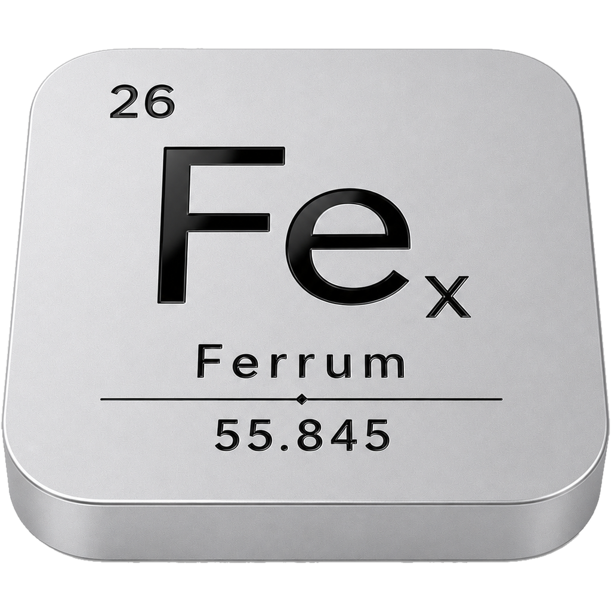
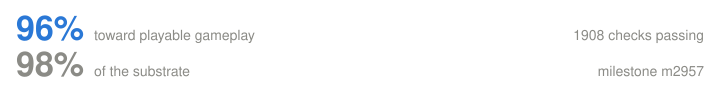
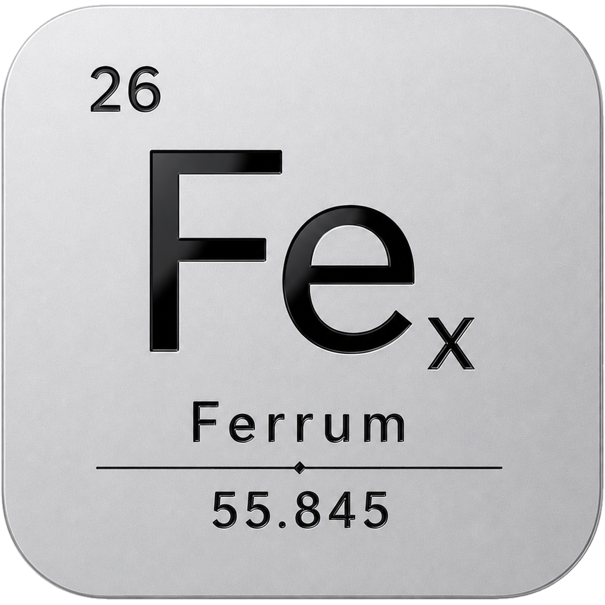

  

<h1 align="center">Ferrum</h1>

<strong>FEX on Apple Silicon.</strong> 
A native macOS x86-64 translation layer — no Rosetta, no virtual machine, no Windows licence.

---

## The problem

Apple is retiring **Rosetta**, the piece of macOS that lets Intel code run on Apple
Silicon. Almost every "Windows games on a Mac" setup quietly depends on it. When it
goes, those setups stop working.

Ferrum is the replacement path. It translates x86-64 Windows code to ARM64 directly,
sits underneath [Wine](https://www.winehq.org/) for the Windows API, and hands
graphics to [DXVK](https://github.com/doitsujin/dxvk) →
[MoltenVK](https://github.com/KhronosGroup/MoltenVK) → Metal. Your games keep
working, on hardware that never had an Intel chip in it.

## What Ferrum adds

Three things Ferrum does that a Rosetta-based stack cannot, each measured rather
than asserted.

**It executes instructions Rosetta refuses.** The standard AVX detection sequence
is two steps: `CPUID` asks "does this machine have AVX?", then `XGETBV` asks the
OS "is it actually enabled?". Rosetta 2 runs AVX2 code perfectly well and then
raises `STATUS_ILLEGAL_INSTRUCTION` (`0xC000001D`) on the `XGETBV` opcode
`0F 01 D0` — it refuses the question, not the work. Final Fantasy VII dies exactly
there, and dies the same way under Apple's own Game Porting Toolkit, so it is not
a Wine bug and no Wine-side fix reaches it. Ferrum implements the whole
`CPUID → XGETBV → XSAVE` dispatch and gates it end to end **inside the guest**,
asserting the exact advertised feature set rather than trusting the host.

**It is not slower.** In a sealed three-way benchmark — Ferrum, CrossOver's ARM64
Wine with FEX, and the same build's x86-64 Wine under Rosetta 2 — Ferrum places
first or inside the 1% tie band on **24 of 34** CPU kernels, the most first places
of the three and the fewest last places. Two results are not close: `rep movsb`
runs at 80.2 GB/s against Rosetta's 4.0 GB/s, and the dependent SSE shuffle at
roughly twice Rosetta's speed.

A later quiet-box campaign sharpened that, and it is worth stating precisely
rather than leaving the flattering reading: most of the `rep movsb` margin is a
property of **FEX-based translation in general**, not of Ferrum specifically —
CrossOver's ARM64 Wine with FEX is already 11.9× Rosetta there, and Ferrum adds
about 1.5× on top of that. It is a strong argument for translating this way
instead of through Rosetta; it is not evidence that Ferrum beats other FEX
stacks. Full method, raw numbers and per-cell placement:
**[the three-way benchmark](docs/translation-benchmark-2026-08-24.md)**.

**It is a component that can be owned.** Rosetta is Apple's, closed, and on its
way out. Ferrum is FEX (MIT) plus Wine (LGPL) with a macOS backend written for
this purpose, so its roadmap, its bug fixes and its lifetime are decisions rather
than announcements.

### Alongside Bourbon, not instead of it

Bourbon's Windows path today runs **x86-64 Wine under Rosetta 2**. That works, and
it will keep working right up until Rosetta does not. What Ferrum replaces is the
layer underneath: a native ARM64 host, FEX only where guest x86-64 actually needs
translating, and a macOS-native NT syscall surface instead of a dependency on
someone else's Wine build. Bottles, Smart Play, the store bridges and the rest of
Bourbon are unaffected — they sit above this line.

**Being straight about the current boundary:** Bourbon runs real games today and
Ferrum does not yet run one end to end. Ferrum boots a real title, renders its
menus through DXVK and presents frames at the display's refresh rate; it does not
yet carry a player through a game. The engine is ahead of the product on the parts
measured above and behind it on finishing a session. Both are true at once, and
the [status section](#status) tracks which is which.

## Why "Ferrum"?

**Ferrum** is Latin for [iron](https://en.wikipedia.org/wiki/Iron), whose symbol is
**Fe**. Add the subscript **x** and you get [**FEX**](https://github.com/FEX-Emu/FEX),
the translation layer underneath. In a chemical formula that subscript counts
**atoms**, so Feₓ reads as *an unspecified quantity of iron* — which is about right
for something that translates an unknown amount of somebody else's code.

Iron carries **26 protons** — and
[**Proton**](https://github.com/ValveSoftware/Proton) is the Wine-and-DXVK stack that
made the Steam Deck work, same job on a different architecture. Element **26**, built
in 2026, shipping in Bourbon 26.

This corner of software also runs on drinks — [Wine](https://www.winehq.org/),
[Whisky](https://getwhisky.app), Bourbon. Fer**rum** has one hiding in it too.

## Status

<!--progress-->

  

<table>
<tr>
<td width="30%"><a href="docs/progress.md#the-vulkan-graphics-bridge">Vulkan graphics bridge</a></td>
<td width="58%"></td>
<td width="12%" align="right"><b>100%</b></td>
</tr>
<tr>
<td width="30%"><a href="docs/progress.md#windows-programs-run">Windows programs run</a></td>
<td width="58%"></td>
<td width="12%" align="right"><b>99%</b></td>
</tr>
<tr>
<td width="30%"><a href="docs/progress.md#game-windows-and-input">Game windows and input</a></td>
<td width="58%"></td>
<td width="12%" align="right"><b>99%</b></td>
</tr>
<tr>
<td width="30%"><a href="docs/progress.md#directx-11">DirectX 11</a></td>
<td width="58%"></td>
<td width="12%" align="right"><b>99%</b></td>
</tr>
<tr>
<td width="30%"><a href="docs/progress.md#sound">Sound</a></td>
<td width="58%"></td>
<td width="12%" align="right"><b>99%</b></td>
</tr>
<tr>
<td width="30%"><a href="docs/progress.md#32-bit-games">32-bit games</a></td>
<td width="58%"></td>
<td width="12%" align="right"><b>99%</b></td>
</tr>
<tr>
<td width="30%"><a href="docs/progress.md#drawing-to-the-screen">Drawing to the screen</a></td>
<td width="58%"></td>
<td width="12%" align="right"><b>98%</b></td>
</tr>
<tr>
<td width="30%"><a href="docs/progress.md#speed">Speed</a></td>
<td width="58%"></td>
<td width="12%" align="right"><b>98%</b></td>
</tr>
<tr>
<td width="30%"><a href="docs/progress.md#installers-and-saves">Installers and saves</a></td>
<td width="58%"></td>
<td width="12%" align="right"><b>98%</b></td>
</tr>
<tr>
<td width="30%"><a href="docs/progress.md#cutscene-video">Cutscene video</a></td>
<td width="58%"></td>
<td width="12%" align="right"><b>98%</b></td>
</tr>
<tr>
<td width="30%"><a href="docs/progress.md#2-d-drawing-for-menus-and-huds">2-D drawing (menus, HUD)</a></td>
<td width="58%"></td>
<td width="12%" align="right"><b>96%</b></td>
</tr>
<tr>
<td width="30%"><a href="docs/progress.md#controllers">Controllers</a></td>
<td width="58%"></td>
<td width="12%" align="right"><b>96%</b></td>
</tr>
<tr>
<td width="30%"><a href="docs/progress.md#shader-stutter">Shader stutter</a></td>
<td width="58%"></td>
<td width="12%" align="right"><b>95%</b></td>
</tr>
<tr>
<td width="30%"><a href="docs/progress.md#directx-12">DirectX 12</a></td>
<td width="58%"></td>
<td width="12%" align="right"><b>94%</b></td>
</tr>
<tr>
<td width="30%"><a href="docs/progress.md#older-directx-versions">Older DirectX versions</a></td>
<td width="58%"></td>
<td width="12%" align="right"><b>82%</b></td>
</tr>
</table>

Every row links to <a href="docs/progress.md">what earned that number</a> — in plain English, no code. Orange is the critical path to a game running. <b>1908 automated checks</b> pass; each one fails if its capability is removed.<!--/progress-->

Real DXVK runs on this port and creates an **`ID3D11Device` at feature level 11_0**.
A **GPU-rendered frame reaches a real macOS window** through a genuine
`VK_KHR_swapchain`. Audio plays through CoreAudio. Translated code costs about
**3.2× native** on the CPU — comfortable headroom inside a 60 fps frame.

Not done: a full game has not been driven end to end yet.

## Product direction

Ferrum is now being developed as a **self-managing, all-in-one compatibility
product**, not a collection of machine-specific paths and manually installed
dependencies. The target architecture keeps Wine's host side native ARM64,
uses FEX only where Windows x86/x64 code needs translation, and chooses the
best graphics path per API and title rather than forcing every workload through
one backend.

The package will carry a complete offline open-source baseline. Optional
components may be acquired by Ferrum itself only from authorized origins, with
an exact version, digest and publisher/signature verification, explicit terms
where required, atomic activation, rollback, and offline reuse. D3DMetal is one
such possible managed component when its authorization permits; an open path
remains the fallback.

Ferrum's runtime, prefixes, downloads, caches and user data are isolated from
Bourbon and from every existing Wine installation. No Homebrew, MacPorts,
`PATH` discovery, manual symlinks, or another product's files are part of the
customer runtime contract.

This is the selected architecture and delivery policy, not a claim that all of
it has shipped. See the **[updated roadmap](docs/roadmap.md#direction-update--august-2026)**
for the implementation order and current boundaries.

Ferrum's source is closed. This repository carries **releases and documentation
only** — no source code. Development happens in a private repository.

## Documentation

- **[How it works](docs/how-it-works.md)** — the four translations, in plain English
- **[Questions people actually ask](docs/faq.md)** — will my games work, do I need
  Windows, is it legal, how fast is it
- **[Progress in detail](docs/progress.md)** — what earned each number on the chart
- **[Roadmap](docs/roadmap.md)** — the self-managing architecture, what stands up,
  what doesn't, and what's next

## Bourbon 26

Ferrum is the engine. **Bourbon** is the app it ships in — a native macOS front end
that installs and drives the whole Windows-gaming stack so you don't have to.

- 🥃 **[Bourbon 26 on itch.io](https://mikethetech.itch.io/bourbon26)** — the app itself
- 📦 **[Bourbon-OSS](https://github.com/PyroSoftPro/Bourbon-OSS)** — open-source
  compatibility data, the DXVK patch, the Steam CEF shim, probes and community
  refresh tools

## Built on

| | |
|---|---|
| [FEX-Emu](https://github.com/FEX-Emu/FEX) | x86/x86-64 → ARM64 translation (MIT) |
| [Wine](https://www.winehq.org/) | the Windows API (LGPL) |
| [DXVK](https://github.com/doitsujin/dxvk) | Direct3D → Vulkan |
| [MoltenVK](https://github.com/KhronosGroup/MoltenVK) | Vulkan → Metal |

## Licensing

Ferrum is **proprietary, closed-source software**. The macOS port is not open
source, and nothing in this repository grants an open-source license to it. See
[`LICENSE`](LICENSE).

You can license it two ways:

- **As part of [Bourbon 26](https://mikethetech.itch.io/bourbon26)** — end users get
  Ferrum as an integrated component under Bourbon's own terms. Nothing extra to sign.
- **Commercially** — for use outside Bourbon, redistribution, embedding, or source
  access. Reach out at **contact@mikethetech.com**.

The code this is built on keeps its own licenses and always will: FEX-Emu stays
**MIT** for everyone (© 2019 Ryan Houdek and contributors),
Wine stays **LGPL** and is loaded at runtime rather than modified, DXVK is **zlib**
and MoltenVK is **Apache-2.0**. Upstream remains
[FEX-Emu/FEX](https://github.com/FEX-Emu/FEX) and is never pushed to.

---

  

