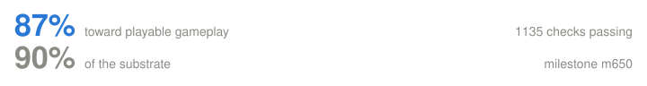

  

<h1 align="center">Ferrum</h1>

<strong>FEX on Apple Silicon.</strong> 
A native macOS x86-64 translation layer — no Rosetta, no virtual machine, no Windows licence.

---

## The problem

Apple is retiring **Rosetta**, the piece of macOS that lets Intel code run on Apple
Silicon. Almost every "Windows games on a Mac" setup quietly depends on it. When it
goes, those setups stop working.

Ferrum is the replacement path. It translates x86-64 Windows code to ARM64 directly,
sits underneath [Wine](https://www.winehq.org/) for the Windows API, and hands
graphics to [DXVK](https://github.com/doitsujin/dxvk) →
[MoltenVK](https://github.com/KhronosGroup/MoltenVK) → Metal. Your games keep
working, on hardware that never had an Intel chip in it.

## Why "Ferrum"?

**Ferrum** is Latin for [iron](https://en.wikipedia.org/wiki/Iron), whose symbol is
**Fe**. Add the subscript **x** and you get [**FEX**](https://github.com/FEX-Emu/FEX),
the translation layer underneath. In a chemical formula that subscript counts
**atoms**, so Feₓ reads as *an unspecified quantity of iron* — which is about right
for something that translates an unknown amount of somebody else's code.

Iron carries **26 protons** — and
[**Proton**](https://github.com/ValveSoftware/Proton) is the Wine-and-DXVK stack that
made the Steam Deck work, same job on a different architecture. Element **26**, built
in 2026, shipping in Bourbon 26.

This corner of software also runs on drinks — [Wine](https://www.winehq.org/),
[Whisky](https://getwhisky.app), Bourbon. Fer**rum** has one hiding in it too.

## Status

<!--progress-->

  

<table>
<tr>
<td width="30%"><a href="docs/progress.md#windows-programs-run">Windows programs run</a></td>
<td width="58%"></td>
<td width="12%" align="right"><b>99%</b></td>
</tr>
<tr>
<td width="30%"><a href="docs/progress.md#game-windows-and-input">Game windows and input</a></td>
<td width="58%"></td>
<td width="12%" align="right"><b>99%</b></td>
</tr>
<tr>
<td width="30%"><a href="docs/progress.md#directx-11">DirectX 11</a></td>
<td width="58%"></td>
<td width="12%" align="right"><b>98%</b></td>
</tr>
<tr>
<td width="30%"><a href="docs/progress.md#drawing-to-the-screen">Drawing to the screen</a></td>
<td width="58%"></td>
<td width="12%" align="right"><b>97%</b></td>
</tr>
<tr>
<td width="30%"><a href="docs/progress.md#cutscene-video">Cutscene video</a></td>
<td width="58%"></td>
<td width="12%" align="right"><b>96%</b></td>
</tr>
<tr>
<td width="30%"><a href="docs/progress.md#the-vulkan-graphics-bridge">Vulkan graphics bridge</a></td>
<td width="58%"></td>
<td width="12%" align="right"><b>92%</b></td>
</tr>
<tr>
<td width="30%"><a href="docs/progress.md#2-d-drawing-for-menus-and-huds">2-D drawing (menus, HUD)</a></td>
<td width="58%"></td>
<td width="12%" align="right"><b>90%</b></td>
</tr>
<tr>
<td width="30%"><a href="docs/progress.md#speed">Speed</a></td>
<td width="58%"></td>
<td width="12%" align="right"><b>90%</b></td>
</tr>
<tr>
<td width="30%"><a href="docs/progress.md#sound">Sound</a></td>
<td width="58%"></td>
<td width="12%" align="right"><b>90%</b></td>
</tr>
<tr>
<td width="30%"><a href="docs/progress.md#controllers">Controllers</a></td>
<td width="58%"></td>
<td width="12%" align="right"><b>85%</b></td>
</tr>
<tr>
<td width="30%"><a href="docs/progress.md#32-bit-games">32-bit games</a></td>
<td width="58%"></td>
<td width="12%" align="right"><b>76%</b></td>
</tr>
<tr>
<td width="30%"><a href="docs/progress.md#installers-and-saves">Installers and saves</a></td>
<td width="58%"></td>
<td width="12%" align="right"><b>74%</b></td>
</tr>
<tr>
<td width="30%"><a href="docs/progress.md#directx-12">DirectX 12</a></td>
<td width="58%"></td>
<td width="12%" align="right"><b>62%</b></td>
</tr>
<tr>
<td width="30%"><a href="docs/progress.md#shader-stutter">Shader stutter</a></td>
<td width="58%"></td>
<td width="12%" align="right"><b>55%</b></td>
</tr>
<tr>
<td width="30%"><a href="docs/progress.md#older-directx-versions">Older DirectX versions</a></td>
<td width="58%"></td>
<td width="12%" align="right"><b>35%</b></td>
</tr>
</table>

Every row links to <a href="docs/progress.md">what earned that number</a> — in plain English, no code. Orange is the critical path to a game running. <b>1135 automated checks</b> pass; each one fails if its capability is removed.<!--/progress-->

Real DXVK runs on this port and creates an **`ID3D11Device` at feature level 11_0**.
A **GPU-rendered frame reaches a real macOS window** through a genuine
`VK_KHR_swapchain`. Audio plays through CoreAudio. Translated code costs about
**3.2× native** on the CPU — comfortable headroom inside a 60 fps frame.

Not done: a full game has not been driven end to end yet.

Ferrum's source is closed. This repository carries **releases and documentation
only** — no source code. Development happens in a private repository.

## Documentation

- **[How it works](docs/how-it-works.md)** — the four translations, in plain English
- **[Questions people actually ask](docs/faq.md)** — will my games work, do I need
  Windows, is it legal, how fast is it
- **[Progress in detail](docs/progress.md)** — what earned each number on the chart
- **[Roadmap](docs/roadmap.md)** — what stands up, what doesn't, what's next

## Bourbon 26

Ferrum is the engine. **Bourbon** is the app it ships in — a native macOS front end
that installs and drives the whole Windows-gaming stack so you don't have to.

- 🥃 **[Bourbon 26 on itch.io](https://mikethetech.itch.io/bourbon26)** — the app itself
- 📦 **[Bourbon-OSS](https://github.com/PyroSoftPro/Bourbon-OSS)** — open-source
  compatibility data, the DXVK patch, the Steam CEF shim, probes and community
  refresh tools

## Built on

| | |
|---|---|
| [FEX-Emu](https://github.com/FEX-Emu/FEX) | x86/x86-64 → ARM64 translation (MIT) |
| [Wine](https://www.winehq.org/) | the Windows API (LGPL) |
| [DXVK](https://github.com/doitsujin/dxvk) | Direct3D → Vulkan |
| [MoltenVK](https://github.com/KhronosGroup/MoltenVK) | Vulkan → Metal |

## Licensing

Ferrum is **proprietary, closed-source software**. The macOS port is not open
source, and nothing in this repository grants an open-source license to it. See
[`LICENSE`](LICENSE).

You can license it two ways:

- **As part of [Bourbon 26](https://mikethetech.itch.io/bourbon26)** — end users get
  Ferrum as an integrated component under Bourbon's own terms. Nothing extra to sign.
- **Commercially** — for use outside Bourbon, redistribution, embedding, or source
  access. Reach out at **contact@mikethetech.com**.

The code this is built on keeps its own licenses and always will: FEX-Emu stays
**MIT** for everyone (© 2019 Ryan Houdek and contributors),
Wine stays **LGPL** and is loaded at runtime rather than modified, DXVK is **zlib**
and MoltenVK is **Apache-2.0**. Upstream remains
[FEX-Emu/FEX](https://github.com/FEX-Emu/FEX) and is never pushed to.

---

  

